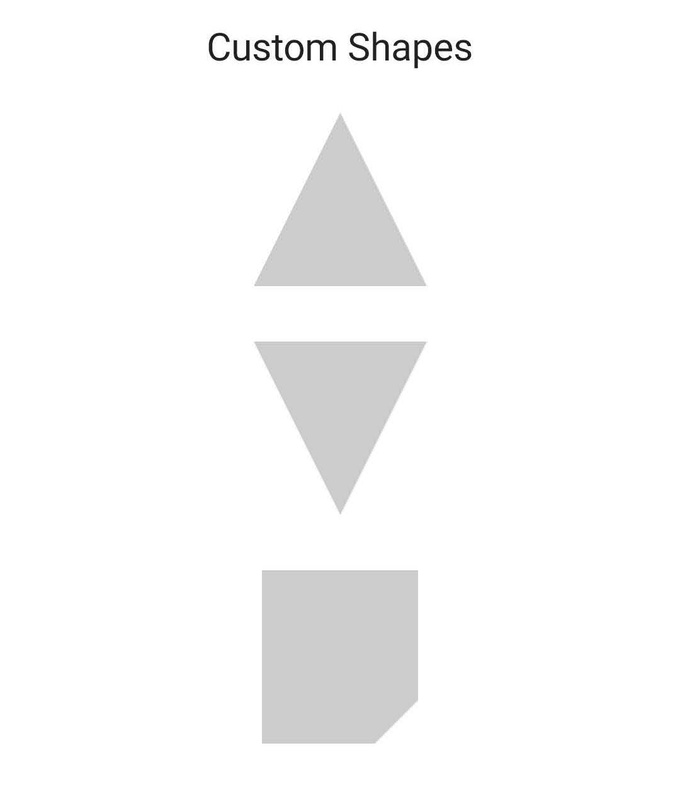

# Jetpack Compose Custom Shape Samples


- [Shape - Jetpack Compose Playground](https://foso.github.io/Jetpack-Compose-Playground/foundation/shape/)
- [How to create a custom shape - Jetpack Compose Playground](https://foso.github.io/Jetpack-Compose-Playground/cookbook/how_to_create_custom_shape/)

### Default Shapes

```kotlin
@Composable
fun Rectangle() {
    Box(
        modifier = Modifier
            .size(100.dp)
            .clip(RectangleShape)
            .background(LightGray)
    )
}
```


### Rotated Shapes

```kotlin
@Composable
fun RoundedCorner(modifier: Modifier = Modifier) {
    Box(
        modifier = modifier
            .size(100.dp)
            .clip(RoundedCornerShape(10.dp))
            .background(LightGray)
    )
}

@Composable
fun RotatedRoundedCorner() {
    RoundedCorner(modifier = Modifier.rotate(25f))
}
```


### Custom Shapes

```kotlin
@Composable
fun CustomCutCorner() {
    val shape = GenericShape { size, _ ->
        lineTo(size.width, 0f)
        val cutSize = size.height / 4
        lineTo(size.width, size.height - cutSize)
        lineTo(size.width - cutSize, size.height)
        lineTo(0f, size.height)
    }

    Box(
        modifier = Modifier
            .width(90.dp)
            .height(100.dp)
            .clip(shape)
            .background(LightGray)
    )
}
```

